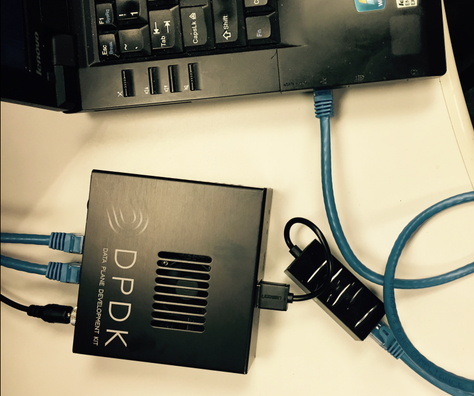

# EECE-DPDK-Course
For UML EECE DPDK Course

For how to log into the DPDK box, you have two options:

	Option1: Use the HDMI cable to connect the HDMI port of the DPDK box to the HDMI port of the monitor which supports HDMI.
	Option2: Connect your Laptop to the DPDK box via the ethernet cable, so that you can ssh log into it.
		1. Insert the USB-RJ45 adapter into the DPDK box USB 2.0 port (the white one).
		2. Power up the DPDK box.
		3. Connect your laptop to the adapter via ethernet cable.
		4. Assign the static IP address 10.0.0.2, and netmask 255.255.255.0 to your laptop.
		5. In the laptop, type "ssh test@10.0.0.1", and then enter password "tester".
		6. Now, you can remotely control your DPDK box on your laptop.

In default, after the DPDK box is booted, the NICs are automatically binded with the igb_uio driver, so you can just quickly start the DPDK application. However in this way, the DPDK box does not have the network access. 

If you really need network access for the DPDK box, type in the terminal of the DPDK box

	"sudo systemctl stop dpdk-config"
	"sudo pkill -9 dhclient"
	"sudo dhclient -v"

After you download someting from internet, and then if you want to bind the NICs with igb_uio driver and start DPDK application on the DPDK box, type in the terminal of the DPDK box

	"sudo systemctl start dpdk-config"

For how to download the repo https://github.com/ACANETS/EECE-DPDK-Course into the DPDK box:
	
	Option1: If you can enable the internet access for the DPDK box, you can directly type in the terminal of the DPDK box "git clone https://github.com/ACANETS/EECE-DPDK-Course" 
	Option2: You can download the repo into your laptop first, then use "scp" to copy it into the DPDK box.
		1. On the laptop, type in the terminal "git clone https://github.com/ACANETS/EECE-DPDK-Course"
		2. On the laptop, type in the terminal "scp -r ./EECE-DPDK-Course test@10.0.0.1:~"

For students who uses Windows laptop:

	For how to configure static IP address, you can find it on this link https://kb.netgear.com/27476/How-to-set-a-static-IP-address-in-Windows
	For how to use SSH, please use PUTTY, https://www.putty.org/
	For how to use SCP, please use WINSCP, https://winscp.net/eng/index.php
	
For students who uses Mac laptop:

	For how to configure static IP address, you can find it on this link https://kb.netgear.com/25191/Configuring-TCP-IP-and-Proxy-Settings-on-Mac-OSX
	For how to use SSH, you can use "ssh"
	For how to use scp, you can use "scp"
	
For students who uses Linux:

	For how to confiture static IP address, you can use "ifconfig"
	For how to use SSH, you can use "ssh"
	For how to use scp, you can use "scp"
