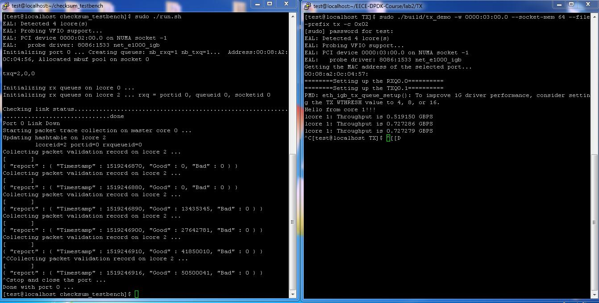
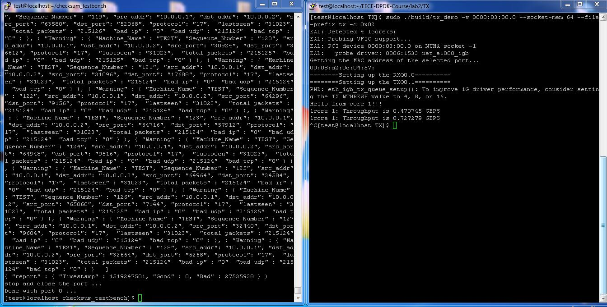

First, please type "make" to compile the code.

Second, please type "sudo ./run.sh" to start the program.

If the checksum of each packet is calculated correctly, then you would see a similar figure like this one

Else, you would probably see a similar figure like this one

