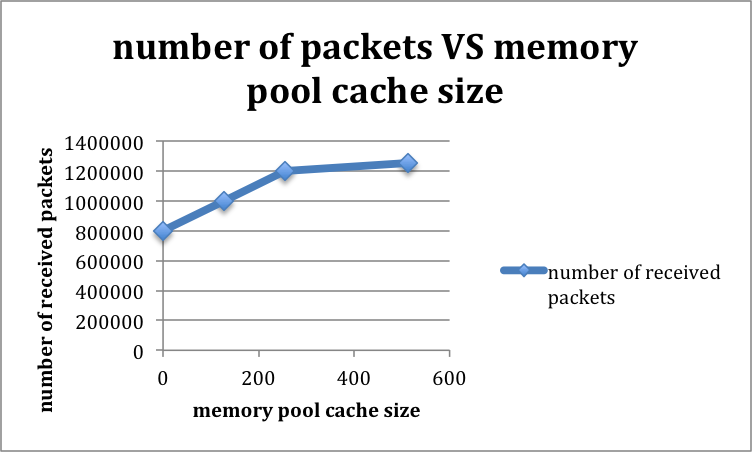

# Lab4

## Introduction:
In Lab2 and Lab3, we learned how to correctly configure and setup DPDK, but we have not looked into any setting parameter. In this Lab4, we are going to look at several setting parameters and find out how each setting parameter affect the performance of the application.  

## Tasks:
1. Modify the source code from Lab3, such that it can report some statistics about how many packets have been received in total.
2. Change the following setting parameter and observe how the number of received packets is changed with respect to each size.

	* In order to setup the RX queue, we have to setup the mempool first.
		* mempool size : 1024, 2\*1024, 4\*1024, 8\*1024, 16\*1024
		* mempool cache size : 0, 128, 256, 512

	* In order to setup the RX queue, we need to setup the RX descriptor and configuration struct.
		* RX descriptor size : 32, 64, 128, 256, 512, 1024
		* configuration struct:
			* rx_thresh
				* pthresh: 0, 2, 4, 8, 16
				* hthresh: 0, 2, 4, 8, 16
				* wthresh: 0, 2, 4, 8, 16
				* rx\_free\_thresh : 0, 8, 16, 32, 64, 128
	
	* In order to setup the TX queue, we need to setup the TX descriptor and configuration struct.
		* TX descriptor size : 32, 64, 128, 256, 512, 1024
		* configuration struct:
			* tx_thresh
				* pthresh: 0, 8, 16, 32, 64
				* hthresh: 0, 2, 4, 8, 16
				* wthresh: 0, 2, 4, 8, 16
				* tx\_rs\_thresh : 0, 2, 4, 8, 16, 32
				* tx\_free\_thresh : 0, 8, 16, 32, 64, 128
	
## Submissions:

A single report which includes the following

1. Attach your added code which is used to report how many packets in total have been received. And, explain your code.
2. Since we need to check many setting parameters, whenever you work on a single parameter, please keep all the remaining parameters stay unchanged as in the lab3. For each setting parameter, make a plot which tells how the number of received packets changes with this setting parameter. For example, you could draw the following 2-D chart to show such relation.

